# Riseholme-2021 🍓 

This repository is the official storage of the novel *Riseholme-2021* dataset, which contains >3.5K images of strawberries at various growth stages along with anomalous instances. 
You can find the first introduction of the dataset in the following paper: 

***"Self-supervised Representation Learning for Reliable Robotic Monitoring of Fruit Anomalies"***. *Taeyeong Choi, Owen Would, Adrian Salazar-Gomez, and Grzegorz Cielniak*. [\[arXiv:2109.10135\]](https://arxiv.org/abs/2109.10135) 

**Data collection** was performed in the "strawberry" research farm at the *Riseholme* campus of the University of Lincoln in UK. 
In particular, a commercial mobile robotic platform, *Thorvald*, was operated as shown below to move along the lanes in polytunnels whilst a side-mounted RGB camera was taking images of normal and anomalous strawberries.  

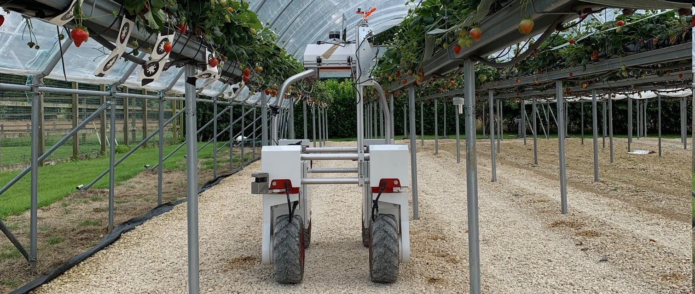

**Data annotation** involved human experts, who examined each image to crop a strawberry-centered region and label with one of the following categories: *Ripe, Unripe, Occluded,* or *Anomalous*. Ripe, Unripe, and Anomalous contain images of single strawberries, while Occluded may have healthy strawberries overlaying one another or covered by green stems. 

**One-class Classification** is the target task for which the Riseholme-2021 dataset has initially been designed under the assumption that during training phase, only the images of normal class are available, although once trained, the detectors are expected to classify anomalous class. For this setting, we recommend learning the models on "all" but the "anomalous" category to later detect images from anomalous as well. 

**Our purpose** of sharing this dataset publicly is to encourage more researchers to develop interests in *fruit anomaly detection*, which is one of the most promising tasks where AI/Robotic systems could help transform agriculture. 
For better facilitation, we offer not only *a large amount of strawberry image data* with basic analyses but the link to the *written manuscript* above that reports the detection performance of state-of-the-art methods based on our experiments as benchmark. 

# Contents

1. [Examples](https://github.com/ctyeong/Riseholme-2021#examples)

1. [Statistics](https://github.com/ctyeong/Riseholme-2021#statistics)

1. [How to Use](https://github.com/ctyeong/Riseholme-2021#how-to-use)

1. [Random Splits](https://github.com/ctyeong/Riseholme-2021#random-splits)

1. [Benchmark Performance](https://github.com/ctyeong/Riseholme-2021#benchmark-performance)

1. [Citation](https://github.com/ctyeong/Riseholme-2021#citation)

1. [Contact](https://github.com/ctyeong/Riseholme-2021#contact)

# Examples 

| Ripe  | Unripe   |Occluded   |Anomalous  |
|--------------------|---------------------|--------------|--------------|
| 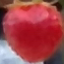| 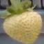 |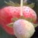 |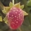 |
| | 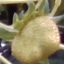 |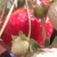 |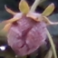 |
| 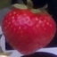| 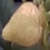 |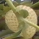 |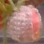 |
| 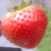| 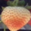 |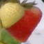 |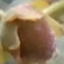 |

Images above display examples of each category label in the dataset. Ripe, Unripe, and Occluded are *normal* strawberries at various growth stages with possible occlusions, whereas anomalous class only contains strawberries with some *health issues*. 

# Statistics 

|                 | All   | Ripe  | Unripe | Occluded | Anomalous |
|---------------- | ------|-------|--------|----------|-----------|
| **# of images** | 3,520 | 462   | 2,406  | 499      | 153       |
| **Percentage**  | 100%  | 13.1% | 68.4%  | 14.2%    | 4.3%      |
| **Avg. WxH**    | 63x66 | 75x81 | 59x61  | 71x75    | 60x60     |
| **Std. WxH**    | 18x23 | 18x22 | 17x22  | 16x21    | 16x17     |

Here is the basic statistics of the images included in Riseholme-2021, where WxH denotes the width x height of image. 
The severe *class imbalance* between normal and anomalous samples (95.7% vs 4.3%) simulates the *rare* occurrence of anomalous observation in realistic detection tasks. 

# How to Use

First, either (1) download the .zip file by using [this link](https://github.com/ctyeong/Riseholme-2021/archive/refs/heads/main.zip) and unzip it or (2) git clone this repository by typing the following command: 

```
$ git clone https://github.com/ctyeong/Riseholme-2021.git
```

You can now find the two folders you need under the root directory downloaded (or extracted): 

- `Data`: All image data under categorical folders, such as "Normal/Ripe", "Normal/Unripe", "Normal/Occluded", and "Anomalous". 
- `Splits`: Sub-folders of three random splits, in each of which text files contain individual file names for Train, Val, and Test sets. More details follow [in the next section](https://github.com/ctyeong/Riseholme-2021#random-splits).

# Random Splits 

Riseholme-2021 is provided with three random splits for estimating the overall performance of learning-based detection algorithms. Each split has exclusive sets of 70%, 10%, and 20% "normal" samples for training, validation, and test, respectively. In addition, four following scenarios are considered to attempt to include different combinations of categories as normal class: 

1. Ripe `(R)`
2. Unripe `(U)`
3. Ripe + Unripe `(RU)`
4. Ripe + Unripe + Occluded `(RUO)`

Because One-class Classification is the default task, the text files in split folders only contain the file names of normal strawberry images assuming all images of "anomalous" strawberry are surely used in tests. For example, `Split1-RUO-Test` has lines like:

```
...
Unripe/3695.png
Unripe/4628.png
Ripe/4007.png
Unripe/1995.png
Ripe/3624.png
Occluded/2760.png
Unripe/887.png
Occluded/839.png
...
```

# Benchmark Performance

For those who are interested in the baseline performance on Riseholme-2021, we refer to the aforementioned paper [***\(Choi et al., 2021\)***](https://arxiv.org/abs/2109.10135) or [***their official GitHub repository***](https://github.com/ctyeong/CH-Rand), in which state-of-the-art frameworks for anomaly detection have been validated, and their novel self-supervised learning approach has also been proposed with the most reliable performance. 

# Citation 
```
@article{CWSC21,
    title={Self-supervised Representation Learning for Reliable Robotic Monitoring of Fruit Anomalies}, 
    author={Taeyeong Choi and Owen Would and Adrian Salazar-Gomez and Grzegorz Cielniak},
    year={2021},
    journal={arXiv},
}
```

# Contact

If there is any questions about the dataset, please do not hesitate to drop an email to tchoi@lincoln.ac.uk or gcielniak@lincoln.ac.uk. Thanks!
