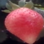

# Riseholme-2021 🍓 

This repository is the official storage of the *Riseholme-2021* dataset, which contains novel images collected for encouraging active research on "fruit" anomaly detection. 
You can find the first introduction of the dataset in the following paper: 

***"Self-supervised Representation Learning for Reliable Robotic Monitoring of Fruit Anomalies"***. *Taeyeong Choi, Owen Would, Adrian Salazar-Gomez, and Grzegorz Cielniak*. [\[arXiv:2109.10135\]](https://arxiv.org/abs/2109.10135) 

Data collection was performed in the "strawberry" research farm at the *Riseholme* campus of the University of Lincoln in UK. 
In particular, a commercial mobile robotic platform, *Thorvald*, was operated as shown below to move along the lanes in polytunnels whilst a side-mounted RGB camera was taking images of normal and anomalous strawberries at various maturity stages.  


Human experts then examined each image to crop a strawberry-centered region and annotate with one of the following category labels: *Ripe, Unripe, Occluded,* or *Anomalous*. Ripe, Unripe, and Anomalous contain images of single strawberries, while Occluded may have strawberries overlaying one another or covered by green stems. 

In addition, the dataset has currently been designed for research under the assumption of One-class Classification, in which during training phase, only the images of normal class are available, although once trained, the detectors are expected to classify anomalous class. For this setting, we recommend learning the models on "all" but the "anomalous" category to later detect images from anomalous as well. 

# Contents

1. [Examples](https://github.com/ctyeong/Riseholme-2021#examples)

2. [Statistics](https://github.com/ctyeong/Riseholme-2021#statistics)

3. [Random Splits](https://github.com/ctyeong/Riseholme-2021#random-split)

4. [Benchmark](https://github.com/ctyeong/Riseholme-2021#benchmark-performance)

5. [Citation](https://github.com/ctyeong/Riseholme-2021#citation)

6. [Contact](https://github.com/ctyeong/Riseholme-2021#contact)

# Examples 

| Ripe  | Unripe   |Occluded   |Anomalous  |
|--------------------|---------------------|--------------|--------------|
| |  | | |
| |  | | |
| |  | | |
| |  | | |

# Statistics 

# Random Splits

# Benchmark Performance

# Citation 
```
@article{CWSC21,
      title={Self-supervised Representation Learning for Reliable Robotic Monitoring of Fruit Anomalies}, 
      author={Taeyeong Choi and Owen Would and Adrian Salazar-Gomez and Grzegorz Cielniak},
      year={2021},
      journal={arXiv},
}
```

# Contact

If there is any questions about the dataset, please do not hesitate to drop an email to tchoi@lincoln.ac.uk or gcielniak@lincoln.ac.uk. Thanks!
